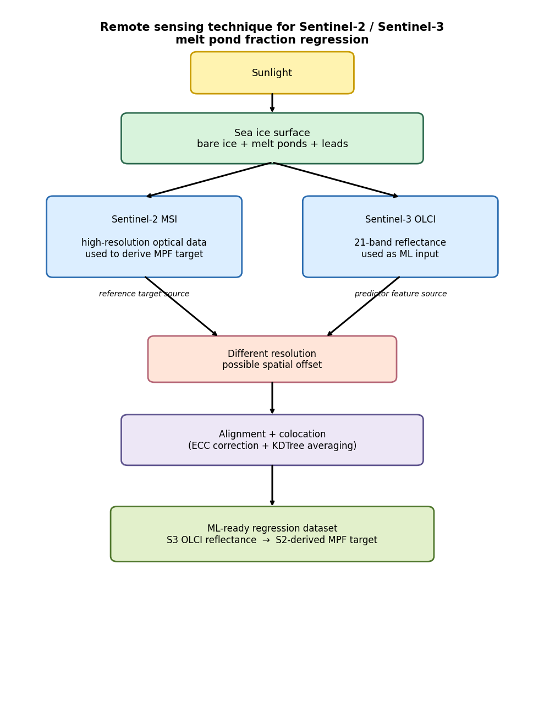
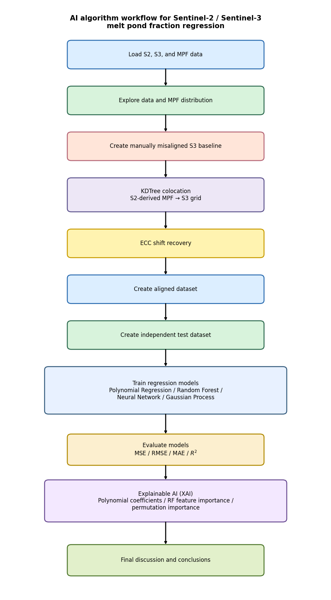
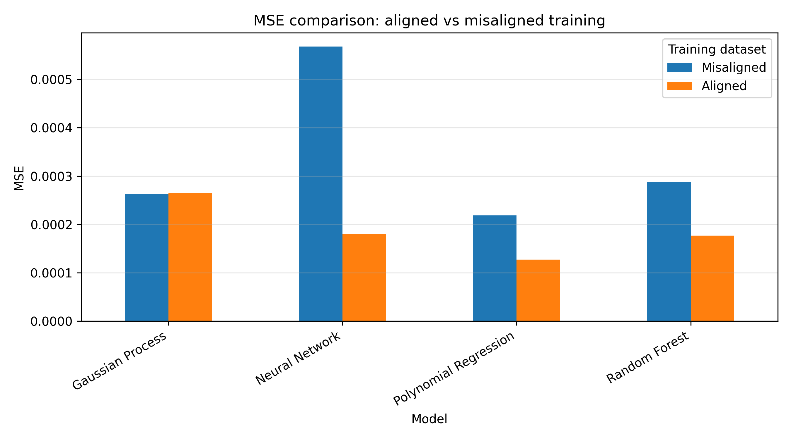
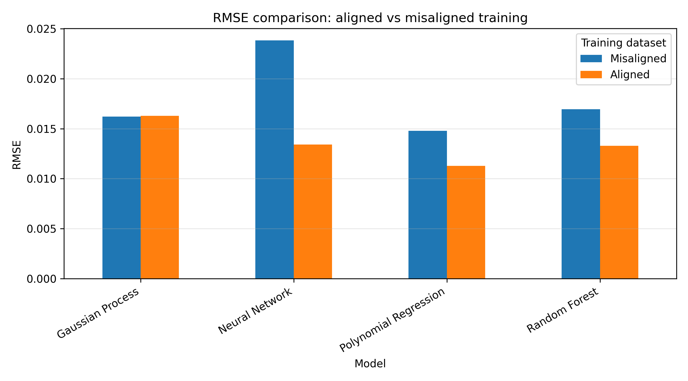
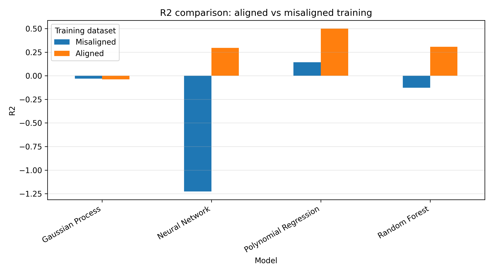
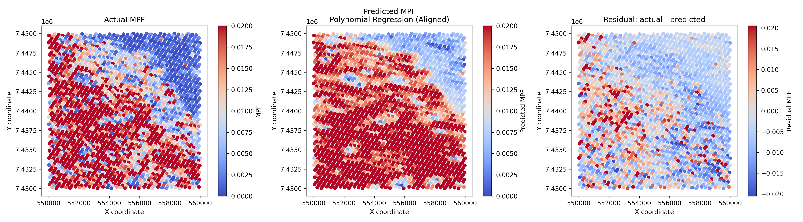
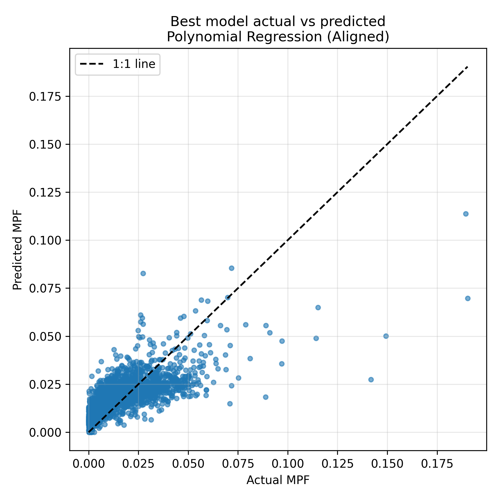
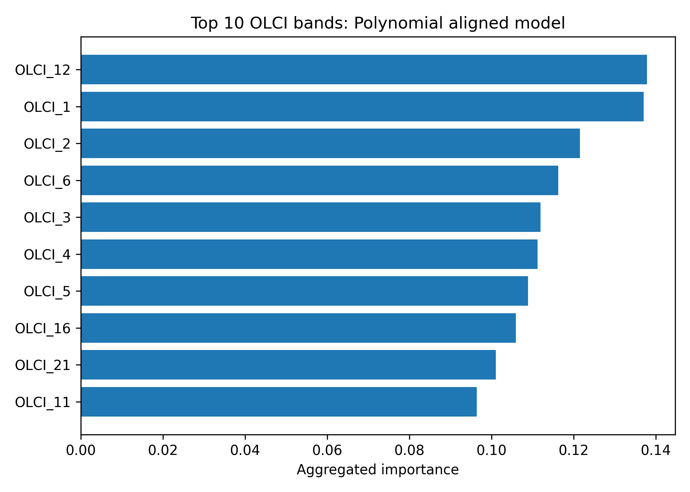
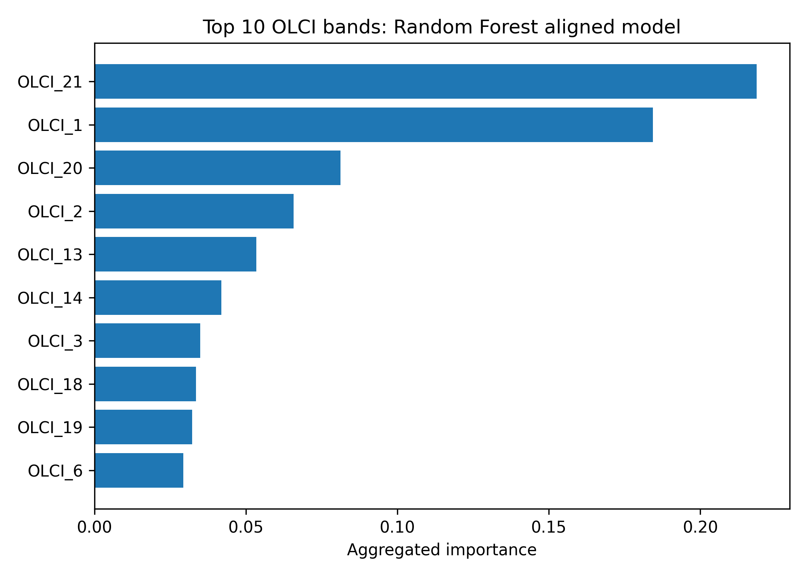
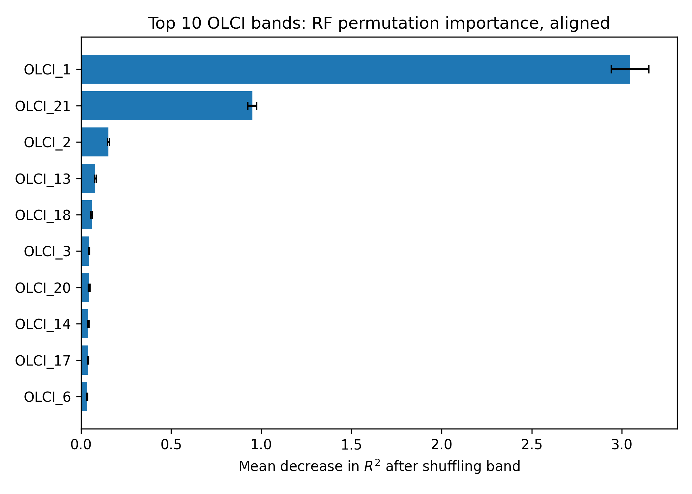

# Predicting Melt Pond Fraction from Sentinel-3 OLCI using Sentinel-2-derived Targets and ECC Alignment

## Project description

This project investigates whether **Sentinel-3 OLCI multispectral reflectance** can be used to predict **Sentinel-2-derived Melt Pond Fraction (MPF)** over sea ice, and whether correcting spatial misalignment between Sentinel-2 and Sentinel-3 improves regression performance.

The project is built around a controlled aligned-versus-misaligned experiment. A deliberately shifted Sentinel-3 training dataset is used as the **no-alignment baseline**, while an **ECC-aligned dataset** is generated by estimating and correcting the spatial displacement between gridded Sentinel-2 and Sentinel-3 imagery. Regression models are trained on both datasets and evaluated on the same independent test region.

The main result is that ECC alignment improved three of the four regression models tested. The best-performing model was **Polynomial Regression trained on the ECC-aligned dataset**, which achieved an independent-test \(R^2\) of **0.500**, compared with **0.143** for the same model trained on the deliberately misaligned dataset. This corresponds to an MSE reduction of approximately **41.7%**.

---

## Research question

**Does ECC-based spatial alignment between Sentinel-2 and Sentinel-3 improve machine-learning prediction of Sentinel-2-derived Melt Pond Fraction from Sentinel-3 OLCI reflectance?**

### Hypothesis

Melt ponds vary over short spatial scales on sea ice. Sentinel-2 provides higher-resolution optical information from which MPF can be derived, while Sentinel-3 OLCI provides coarser 21-band multispectral reflectance. If Sentinel-2 and Sentinel-3 observations are spatially mismatched, Sentinel-3 reflectance values can be paired with incorrect Sentinel-2-derived MPF targets, introducing label noise into the regression dataset.

Therefore, a model trained on an ECC-aligned dataset is expected to produce lower prediction error and more spatially coherent MPF maps than a model trained on a deliberately misaligned dataset.

---

## Scientific background

### Melt ponds and sea ice

Melt ponds form on the surface of sea ice during the summer melt season. They are important because they reduce sea-ice albedo, allowing more solar radiation to be absorbed by the ice-ocean system. This can accelerate surface melt and influence the seasonal evolution of Arctic sea ice.

Mapping melt pond fraction over large areas is difficult because melt ponds are spatially heterogeneous and often occur at scales smaller than the resolution of coarser satellite sensors. Multi-sensor Earth observation can help by combining higher-resolution imagery with broader-coverage multispectral measurements.

### Sentinel-2 and Sentinel-3 satellite synergy

This project uses two optical Earth-observation sensors:

- **Sentinel-2** provides higher-resolution optical imagery and is used here as the source of the MPF target.
- **Sentinel-3 OLCI** provides 21-band multispectral reflectance and is used here as the machine-learning input feature set.

The key AI4EO challenge is that these two sensors do not sample the surface in exactly the same way. They have different spatial resolutions, different sampling grids, and potentially different acquisition times. Over moving sea ice, even a small spatial displacement can mean that the Sentinel-3 reflectance vector is paired with the wrong Sentinel-2-derived MPF value. This project tests whether correcting that displacement improves downstream regression.

---

## Remote sensing technique

The required remote-sensing technique figure is shown below.



**Figure summary.** Sentinel-2 provides high-resolution optical information from which MPF is derived. Sentinel-3 OLCI provides coarser multispectral reflectance used as the regression input. Because the two sensors have different sampling characteristics and because sea ice can drift between acquisitions, spatial alignment and colocation are needed before machine-learning models can reliably learn the relationship between OLCI reflectance and MPF.

---

## AI / machine-learning methodology

The full AI implementation workflow is shown below.



The workflow has four main stages:

1. **Data exploration**  
   Sentinel-2 reflectance, Sentinel-3 OLCI reflectance, and Sentinel-2-derived MPF are loaded and inspected. The MPF distribution is strongly skewed toward low values, so model evaluation must use both quantitative metrics and spatial maps.

2. **Aligned and misaligned dataset creation**  
   A deliberately misaligned Sentinel-3 dataset is created by applying a manual spatial shift of:

   \[
   dx = 1500\ \text{m}, \quad dy = -1500\ \text{m}
   \]

   MPF values from Sentinel-2 are then averaged onto the shifted Sentinel-3 grid using KDTree nearest-neighbour colocation. This creates the no-alignment baseline dataset.

   An ECC image-alignment step is then used to estimate and correct the displacement. The corrected Sentinel-3 coordinates are used to rebuild the aligned MPF training dataset.

3. **Regression modelling**  
   Four regression models are trained on both aligned and misaligned datasets:

   - Polynomial Regression
   - Random Forest Regression
   - Neural Network Regression
   - Gaussian Process Regression

   Each model is evaluated on the same independent test region.

4. **Evaluation and explainability**  
   Models are compared using MSE, RMSE, MAE, and \(R^2\). Spatial prediction maps, residual maps, and actual-versus-predicted plots are used to assess the physical structure of predictions. Explainable AI analysis is carried out using Polynomial Regression coefficients, Random Forest feature importance, and permutation importance.

---

## Repository structure

```text
GEOL0069_S2S3_MPF_Alignment_Regression/
│
├── README.md
├── LICENSE
├── requirements.txt
├── .gitignore
│
├── notebooks/
│   ├── 01_data_exploration.ipynb
│   ├── 02_create_aligned_misaligned_datasets.ipynb
│   ├── 03_regression_models.ipynb
│   ├── 04_results_xai_and_discussion.ipynb
│   └── remote_sensing_technique.ipynb
│
├── data/
│   ├── raw/
│   │   └── README_data.md
│   └── processed/
│       ├── training_data_noalign.npz
│       ├── training_data_aligned.npz
│       └── test_data.npz
│
├── figures/
│   ├── remote_sensing_technique.png
│   ├── ai_algorithm_workflow.png
│   ├── data_exploration/
│   ├── alignment/
│   ├── regression_results/
│   └── xai/
│
├── results/
│   ├── metrics_summary.csv
│   ├── final_alignment_improvement.csv
│   ├── final_ranked_model_metrics.csv
│   ├── predictions_aligned_vs_misaligned.csv
│   ├── predictions_aligned_vs_misaligned.npz
│   ├── alignment_summary.csv
│   ├── dataset_summary.csv
│   └── xai_*.csv
│
├── models/
│   ├── polynomial_aligned.joblib
│   ├── polynomial_noalign.joblib
│   ├── neural_network_aligned.keras
│   ├── neural_network_noalign.keras
│   ├── neural_network_scaler_aligned.joblib
│   ├── neural_network_scaler_noalign.joblib
│   ├── random_forest_aligned.joblib
│   ├── random_forest_noalign.joblib
│   ├── gaussian_process_aligned.joblib
│   └── gaussian_process_noalign.joblib
│
└── src/
    ├── data_utils.py
    ├── alignment_utils.py
    ├── colocation_utils.py
    ├── model_utils.py
    └── plotting_utils.py
```

---

## Data

### Raw data

The raw `.npz` data files are not stored directly in this repository because some are too large for standard GitHub upload.

To reproduce the project, place the following files in `data/raw/`:

```text
data/raw/
├── s2_zoomed_data.npz
├── s3_zoomed_data.npz
├── mpf_zoomed_data.npz
├── interpolated_data.npz
└── training_data_subsubarea_noalign.npz
```

Expected raw data structure:

| File | Main arrays | Description |
|---|---|---|
| `s2_zoomed_data.npz` | `x`, `y`, `band_data` | Sentinel-2 coordinates and reflectance bands |
| `s3_zoomed_data.npz` | `x`, `y`, `reflectance` | Sentinel-3 coordinates and 21-band OLCI reflectance |
| `mpf_zoomed_data.npz` | `x`, `y`, `mpf` | Sentinel-2-derived Melt Pond Fraction target |
| `interpolated_data.npz` | `xg`, `yg`, `z_s2`, `z_s3` | Gridded S2/S3 data used for alignment checks |
| `training_data_subsubarea_noalign.npz` | `s3_x`, `s3_y`, `s3_features`, `mpf_target` | Provided no-alignment training baseline |

### Processed data

The processed datasets are generated by `02_create_aligned_misaligned_datasets.ipynb`:

| File | Description |
|---|---|
| `training_data_noalign.npz` | Training data created using shifted Sentinel-3 coordinates |
| `training_data_aligned.npz` | Training data created after ECC alignment correction |
| `test_data.npz` | Independent spatial test region used for all models |

The processed datasets use the following structure:

| Key | Description |
|---|---|
| `s3_x` | Sentinel-3 x coordinates |
| `s3_y` | Sentinel-3 y coordinates |
| `s3_features` | 21-band Sentinel-3 OLCI reflectance input matrix |
| `mpf_target` | Sentinel-2-derived MPF averaged onto the S3 grid |
| `s2_count` | Number of Sentinel-2 points assigned to each Sentinel-3 point |
| `mean_distance` | Mean S2-to-S3 colocation distance |

### Dataset summary

| Dataset | Samples | Features | MPF min | MPF max | MPF mean | MPF std | Mean S2 count | Mean distance |
|---|---:|---:|---:|---:|---:|---:|---:|---:|
| No-alignment training | 4725 | 21 | 0.000 | 0.245 | 0.0142 | 0.0143 | 212.1 | 111.8 m |
| ECC-aligned training | 4732 | 21 | 0.000 | 0.249 | 0.0142 | 0.0142 | 211.8 | 111.8 m |
| Independent test | 2386 | 21 | 0.000 | 0.190 | 0.0169 | 0.0160 | 210.2 | 111.6 m |

---

## Models

The `models/` directory contains trained model artefacts saved from Notebook 3. These are useful for reproducing predictions without retraining every model.

| File | Description |
|---|---|
| `polynomial_aligned.joblib` | Polynomial Regression trained on ECC-aligned data |
| `polynomial_noalign.joblib` | Polynomial Regression trained on no-alignment data |
| `neural_network_aligned.keras` | Neural Network trained on ECC-aligned data |
| `neural_network_noalign.keras` | Neural Network trained on no-alignment data |
| `neural_network_scaler_aligned.joblib` | Feature scaler for aligned Neural Network |
| `neural_network_scaler_noalign.joblib` | Feature scaler for no-alignment Neural Network |
| `random_forest_aligned.joblib` | Random Forest trained on ECC-aligned data |
| `random_forest_noalign.joblib` | Random Forest trained on no-alignment data |
| `gaussian_process_aligned.joblib` | Gaussian Process trained on ECC-aligned data |
| `gaussian_process_noalign.joblib` | Gaussian Process trained on no-alignment data |

## Model artefacts

The trained model artefacts are generated by Notebook 3. Smaller model files may be included in the repository, but larger binary files such as the Random Forest `.joblib` models are stored externally on Google Drive because they are too large for browser-based GitHub uploads.

The models are reproducible from the notebooks. To regenerate them, run:

```text
notebooks/02_create_aligned_misaligned_datasets.ipynb
notebooks/03_regression_models.ipynb

### Note on GitHub file size

The trained model directory is useful, but it can be large. In this project, the full `models/` folder is approximately 108 MB. Individual Random Forest models are approximately 35 MB each, and individual Gaussian Process models are approximately 17 MB each.

If GitHub upload limits are a problem, the safest approach is:

1. Include small model artefacts if possible, especially the Polynomial and Neural Network models.
2. Do not upload large `.joblib` model files through the GitHub web interface if they exceed upload limits.
3. Add large models to `.gitignore` or use Git LFS.
4. Explain in this README that all models can be regenerated by running `03_regression_models.ipynb`.

The notebooks are the authoritative reproducible workflow. The model files are convenient outputs, not a replacement for the code.

---

## Installation

Clone the repository:

```bash
git clone <your-repository-url>
cd GEOL0069_S2S3_MPF_Alignment_Regression
```

Install dependencies:

```bash
pip install -r requirements.txt
```

Suggested `requirements.txt`:

```text
numpy
pandas
matplotlib
scipy
scikit-learn
opencv-python
tensorflow
GPy
joblib
jupyter
```

If using Google Colab, mount Google Drive and update the project path at the top of each notebook if required.

---

## How to run

Run the notebooks in this order:

### 1. Data exploration

```text
notebooks/01_data_exploration.ipynb
```

This notebook loads the raw S2, S3, and MPF data, prints keys and shapes, plots reflectance/MPF maps, and visualises the MPF distribution.

### 2. Create aligned and misaligned datasets

```text
notebooks/02_create_aligned_misaligned_datasets.ipynb
```

This notebook creates the no-alignment and ECC-aligned training datasets. It also creates the independent test region.

### 3. Train regression models

```text
notebooks/03_regression_models.ipynb
```

This notebook trains Polynomial Regression, Random Forest, Neural Network, and Gaussian Process models on both aligned and misaligned datasets. It saves metrics, predictions, figures, and model artefacts.

### 4. Results, XAI, and discussion

```text
notebooks/04_results_xai_and_discussion.ipynb
```

This notebook ranks the models, plots final comparison figures, analyses feature importance, and gives the final scientific interpretation.

---

## Alignment experiment

A manual spatial displacement was applied to Sentinel-3 coordinates to create the deliberately misaligned baseline:

\[
 dx = 1500\ \text{m}, \quad dy = -1500\ \text{m}
\]

ECC alignment recovered a broadly similar correction:

| Quantity | Value |
|---|---:|
| Manual \(dx\) | 1500 m |
| Manual \(dy\) | -1500 m |
| ECC recovered \(dx\) | 1913.9 m |
| ECC recovered \(dy\) | -1232.0 m |
| Residual shift | 493.1 m |
| ECC correlation | 0.637 |

The residual shift shows that ECC did not perfectly recover the imposed displacement. This is expected because Sentinel-2 and Sentinel-3 have different spatial resolutions and spectral characteristics, and the Sentinel-3 image is smoother than the Sentinel-2 reference. Therefore, the aligned dataset should be interpreted as an ECC-corrected dataset rather than a perfectly registered ground truth.

---

## Results

### Model performance on independent test region

| Model | Training dataset | MSE | RMSE | MAE | \(R^2\) |
|---|---|---:|---:|---:|---:|
| Polynomial Regression | Aligned | 0.000127 | 0.011290 | 0.008202 | 0.500 |
| Polynomial Regression | Misaligned | 0.000219 | 0.014782 | 0.010884 | 0.143 |
| Random Forest | Aligned | 0.000177 | 0.013300 | 0.009994 | 0.306 |
| Random Forest | Misaligned | 0.000287 | 0.016949 | 0.012747 | -0.126 |
| Neural Network | Aligned | 0.000180 | 0.013404 | 0.010395 | 0.295 |
| Neural Network | Misaligned | 0.000568 | 0.023833 | 0.017542 | -1.227 |
| Gaussian Process | Aligned | 0.000265 | 0.016275 | 0.011560 | -0.039 |
| Gaussian Process | Misaligned | 0.000263 | 0.016206 | 0.011507 | -0.030 |

### Alignment improvement

| Model | MSE improvement | \(R^2\) change | Interpretation |
|---|---:|---:|---|
| Polynomial Regression | 41.7% | +0.357 | Strong improvement; best model overall |
| Random Forest | 38.4% | +0.433 | Clear improvement with alignment |
| Neural Network | 68.4% | +1.523 | Very strong improvement, mainly because the misaligned model performed poorly |
| Gaussian Process | -0.9% | -0.009 | Did not improve |

The best-performing model was **Polynomial Regression trained on the ECC-aligned dataset**, with \(R^2 = 0.500\). Alignment improved three of the four regression models tested. This supports the hypothesis that spatially consistent S2/S3 colocation improves the relationship learned between Sentinel-3 OLCI reflectance and Sentinel-2-derived MPF.

### Key result figures

#### Final metric comparisons







#### Best model prediction and residual maps



#### Best model actual vs predicted plot



---

## Explainable AI / feature importance

Explainable AI was used to identify which Sentinel-3 OLCI bands most strongly influenced MPF predictions.

Three approaches were used:

1. **Polynomial coefficient analysis**  
   Coefficients from the aligned Polynomial Regression model were grouped by Sentinel-3 OLCI band to estimate band-level importance.

2. **Random Forest feature importance**  
   The aligned Random Forest model was used to estimate impurity-based feature importance for each OLCI band.

3. **Permutation importance**  
   Each OLCI band was shuffled on the test set and the resulting change in model performance was measured.

### Polynomial Regression band importance

For the aligned Polynomial Regression model, the most important grouped OLCI bands included:

| Rank | OLCI band | Importance |
|---:|---|---:|
| 1 | OLCI 12 | 0.1379 |
| 2 | OLCI 1 | 0.1371 |
| 3 | OLCI 2 | 0.1215 |
| 4 | OLCI 6 | 0.1162 |
| 5 | OLCI 3 | 0.1120 |



### Random Forest band importance

For the aligned Random Forest model, the most important OLCI bands were:

| Rank | OLCI band | Importance |
|---:|---|---:|
| 1 | OLCI 21 | 0.2186 |
| 2 | OLCI 1 | 0.1844 |
| 3 | OLCI 20 | 0.0812 |
| 4 | OLCI 2 | 0.0658 |
| 5 | OLCI 13 | 0.0535 |



### Permutation importance

Permutation importance for the aligned Random Forest model showed the strongest dependence on **OLCI 1**, followed by **OLCI 21**.

| Rank | OLCI band | Mean permutation importance |
|---:|---|---:|
| 1 | OLCI 1 | 3.0450 |
| 2 | OLCI 21 | 0.9501 |
| 3 | OLCI 2 | 0.1525 |
| 4 | OLCI 13 | 0.0799 |
| 5 | OLCI 18 | 0.0603 |



The feature-importance results should be interpreted as model sensitivity rather than a direct physical proof of band causality. However, the difference between aligned and misaligned feature rankings suggests that spatial alignment changes the stability and quality of the spectral relationship learned by the models.

---

## Discussion

### Did alignment improve regression?

Yes, for three of the four models. Polynomial Regression, Random Forest, and Neural Network models all improved substantially when trained on the ECC-aligned dataset rather than the deliberately misaligned dataset.

The strongest overall result was Polynomial Regression. It achieved the highest independent-test \(R^2\), lowest MSE, and lowest RMSE. This suggests that, for this dataset, the relationship between Sentinel-3 OLCI reflectance and Sentinel-2-derived MPF could be captured effectively by a relatively simple nonlinear model once spatial colocation was improved.

### Why did alignment help?

The no-alignment dataset deliberately pairs Sentinel-3 observations with MPF targets from shifted spatial locations. This introduces label noise because the input reflectance and target MPF do not necessarily represent the same surface. ECC alignment reduces this mismatch, improving the physical consistency of the training data.

The results show that alignment is not only a preprocessing detail. In this experiment, it directly affected downstream machine-learning performance.

### Why did the Gaussian Process perform poorly?

The Gaussian Process model produced weak negative \(R^2\) values for both aligned and misaligned training. This suggests that the chosen GP setup did not capture the relationship well. Possible reasons include subsampling, kernel choice, limited hyperparameter tuning, computational constraints, and the strongly skewed MPF target distribution.

### Limitations

This project has several limitations:

- The misalignment is artificial and translational, whereas real sea-ice drift can include rotation, shear, deformation, and non-rigid motion.
- ECC assumes a simple translation and cannot correct complex deformation.
- The MPF target is strongly skewed toward low values, so models may perform well numerically while still missing rare high-MPF regions.
- Sentinel-2 and Sentinel-3 have different spatial resolutions and spectral responses.
- The independent test region is spatially separate but still from the same broader scene.
- The MPF product is Sentinel-2-derived and is not independent field validation.
- Gaussian Process results may be sensitive to subsampling and kernel choice.

### Future work

Further work could improve this project by:

- Testing the workflow on multiple dates and Arctic regions.
- Applying the model to a fully independent summer scene.
- Comparing ECC with phase correlation and optical-flow methods such as SEA-RAFT.
- Using real sea-ice drift estimates rather than artificial displacement.
- Tuning Gaussian Process kernels and inducing points more systematically.
- Using XAI-selected OLCI bands to retrain simpler models.
- Validating MPF predictions against independent labelled or field-derived data.

---

## Main conclusion

This project tested whether Sentinel-2/Sentinel-3 image alignment improves machine-learning prediction of Melt Pond Fraction from Sentinel-3 OLCI reflectance. Using Sentinel-2-derived MPF as the target and 21-band Sentinel-3 OLCI reflectance as the input, regression models were trained on both deliberately misaligned and ECC-aligned datasets.

The results show that ECC alignment improved three of the four regression models. The strongest result was Polynomial Regression, where alignment increased \(R^2\) from **0.143** to **0.500** and reduced MSE by approximately **41.7%**. This supports the hypothesis that spatially consistent Sentinel-2/Sentinel-3 colocation improves the learned relationship between Sentinel-3 OLCI reflectance and Sentinel-2-derived MPF.

Overall, the project demonstrates that image alignment is not simply a preprocessing step. It can directly affect downstream AI model performance in multi-sensor Earth observation.

---

## Video

A short tutorial video should be added for the final submission.

Suggested video structure:

1. Introduce the research question.
2. Explain why MPF matters.
3. Explain the Sentinel-2/Sentinel-3 remote-sensing setup.
4. Show the remote-sensing technique figure.
5. Show the AI workflow diagram.
6. Walk through the four notebooks.
7. Show the final metrics table.
8. Explain whether alignment improved performance.
9. Discuss feature importance, limitations, and future work.

Video link: `ADD VIDEO LINK HERE`

---

## Reproducibility checklist

To reproduce the project:

1. Clone the repository.
2. Install dependencies using `pip install -r requirements.txt`.
3. Place the required raw `.npz` files in `data/raw/`.
4. Run notebooks in numerical order.
5. Check that processed datasets are generated in `data/processed/`.
6. Check that metrics are generated in `results/`.
7. Check that figures are generated in `figures/`.
8. Use Notebook 4 to reproduce the final result tables and XAI plots.

---

## GitHub upload notes

Recommended `.gitignore` entries:

```gitignore
# Large raw data files
data/raw/*.npz
data/raw/*.npy
data/raw/*.zip
*.SAFE/
*.tif
*.tiff
*.nc
*.h5
*.hdf5

# Optional: ignore large trained model files if not using Git LFS
models/*.joblib
models/*.keras

# Keep documentation files
!data/raw/README_data.md
!data/processed/README_processed.md
!models/README_models.md

# Python and notebook clutter
__pycache__/
.ipynb_checkpoints/
.DS_Store
```

If the model artefacts are too large for normal GitHub upload, they can be regenerated by running `03_regression_models.ipynb`.

---

## References

- GEOL0069 AI for Earth Observation course guidebooks: data fetching, Sentinel-2/Sentinel-3 colocation, regression, image alignment, Gaussian Processes, and Explainable AI.
- ESA Sentinel-2 mission documentation.
- ESA Sentinel-3 OLCI mission documentation.
- OpenCV documentation for Enhanced Correlation Coefficient image alignment.
- scikit-learn documentation for Polynomial Regression, Random Forest Regression, metrics, and permutation importance.
- TensorFlow/Keras documentation for Neural Network regression.
- GPy documentation for Gaussian Process Regression.

---

## Acknowledgements

This project was developed for **GEOL0069: Artificial Intelligence for Earth Observation** at UCL. The project builds on course practicals covering Sentinel-2/Sentinel-3 colocation, MPF regression, image alignment, Gaussian Processes, and Explainable AI.

---

## License

This repository is intended for educational coursework use. Add an appropriate open-source license, such as the MIT License, if the repository is made public.
